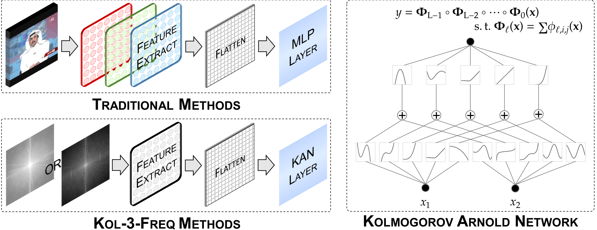
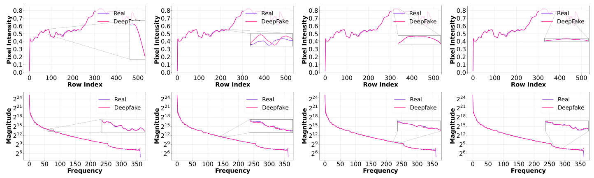
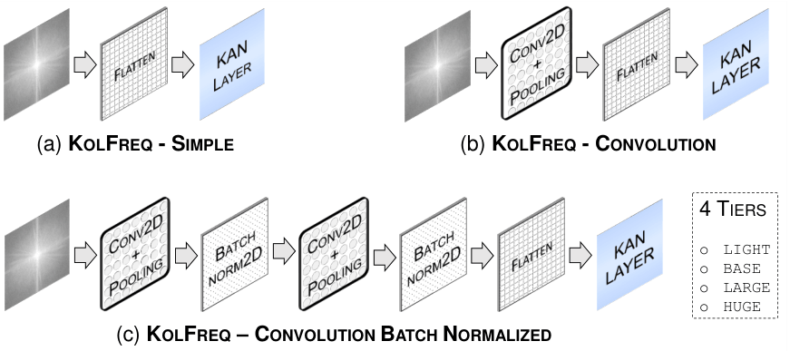

# Kol-3-Freq: Frequency-Aware Video Deepfake Detection Using Kolmogorov-Arnold Networks

Official implementation of **Kol-3-Freq**, a set of three lightweight, interpretable
frequency-domain deepfake detectors built on **Kolmogorov-Arnold Networks (KAN)**.

> Deepfakes generated by GANs, VAEs, or diffusion models are spatio-temporally coherent,
> but leave prominent inconsistencies in the **spectral domain**. Kol-3-Freq exploits these
> frequency-domain artifacts using a KAN-based classifier, achieving **~2.181x** lower model
> complexity and a **~1.4106%** competitive accuracy improvement over spatial/spectral
> state-of-the-art baselines, with as few as **1.44 million parameters**.

  

---

## 📌 Overview

Most deepfake detectors operate in the spatial domain, learning pixel-level manipulations,
facial landmarks, or texture artifacts. While accurate in-dataset, these methods struggle to
generalize to unseen forgery techniques. **Kol-3-Freq** instead classifies videos using the
**Discrete Fourier Transform (DFT)** of frames, exploiting the fact that convolutional/
upsampling operations in generative models leave broadband spectral inconsistencies
(theoretically justified via Propositions I-V in the paper) that are highly discriminative
and largely invariant across generator architectures.

  
   
  <em>Spatial (localized) vs. Spectral (distributed) differences between real and deepfake frames.</em>

Three model variants are proposed, differing in their feature-extraction module:

| Model | Feature Extractor | Description |
|---|---|---|
| **KolFreq-Simple** | None (flatten) | DFT flattened directly and fed to a KAN classifier |
| **KolFreq-Convolution** | Conv2D + MaxPool | Shallow conv feature extractor followed by KAN |
| **KolFreq-Convolution-BN** | Conv2D + BatchNorm + MaxPool | Convolution stack with batch normalization + KAN |

Each variant is further scaled into **four tiers** based on input feature dimensionality:

| Tier | Abbreviation | Input Dimension |
|---|---|---|
| Light | `KF-Li` | Temporal average of per-frame DFTs |
| Base | `KF-B` | 64 x 64 |
| Large | `KF-L` | 128 x 128 |
| Huge | `KF-H` | 256 x 256 |

---

## 🏗️ Architecture

The pipeline computes the DFT of each frame (or its temporal average for the Light tier),
extracts compact features via a shallow CNN (for the Convolution/Conv-BN variants), and
classifies the resulting features using a KAN layer with learnable B-spline / polynomial
univariate activations instead of a fixed-activation MLP.

  
   
  <em>Architectural view of the three Kol-3-Freq models (Simple, Convolution, Convolution-BN),
  each available in Light, Base, Large, and Huge tiers.</em>

